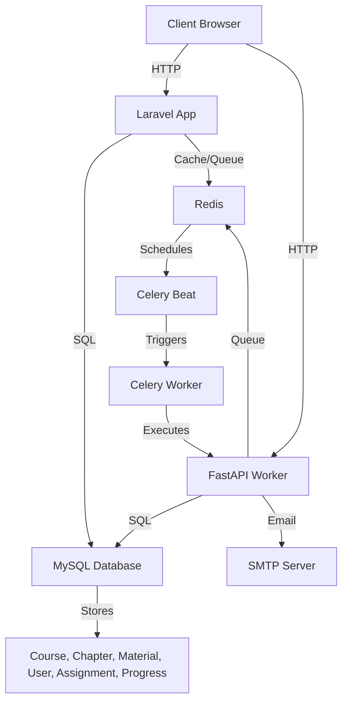

# EduTMS - Education Training Management System

## 專案簡介（Description）
EduTMS 是一個專為企業與學校設計的教育訓練管理系統（Training Management System），提供高效的課程管理、訓練指派、進度追蹤、角色權限控制（RBAC）以及報表生成功能。系統採用 Laravel（後端網頁與 API）與 FastAPI（非同步任務處理）結合，透過 Docker 多容器架構實現可擴充與高效能部署，支援多語言（繁體中文與英文）介面，特別適用於台灣數位學習場景。

## 功能介紹（Features）
- **使用者登入與角色權限（RBAC）**：
  - 支援 JWT（Sanctum）與 Session-based 認證，確保安全訪問。
  - 角色包括 Admin、Instructor、Student、HR，具備動態權限控制。
  - 動態儀表板依角色顯示客製化 KPI（如課程數、平均進度）。
  - 多語言支援，實現繁體中文與英文即時切換。

- **課程管理**：
  - 課程 CRUD 操作，支援縮圖上傳（JPEG/PNG，最大 2MB）、分類管理。
  - 課程結構包含章節（Chapters）與教材（Materials），支援 PDF、影片（MP4/MOV/MKV，最大 200MB）與 URL。
  - 講師可創建與編輯內容，學員可瀏覽與學習課程。

- **訓練指派與進度追蹤**：
  - 支援個人或群組課程指派，設定到期日。
  - 即時追蹤學員進度（章節與課程完成百分比）。
  - FastAPI 與 Celery 實現自動化到期提醒（Email）。

- **報表與統計**：
  - 提供課程完成率、熱門度與學員活躍度報表。
  - 使用 Chart.js 繪製 Bar/Pie 圖表，支援 Excel/CSV 匯出。
  - 管理者與 HR 可視化訓練成效與統計數據。

- **技術架構**：
  - Docker 化部署，整合 Laravel、FastAPI、MySQL、Redis、Celery Worker/Beat。
  - GitHub Actions 實現 CI/CD 自動化測試與建置。
  - 環境變數模組化，支援 dev/test/prod 環境。

## 安裝與執行指引（Setup）
### 前置條件
- **系統要求**：
  - PHP 8.2
  - Python 3.11
  - Node.js 18
  - Docker 與 Docker Compose
  - MySQL 8.0
  - Redis
- **依賴清單**：
  - **PHP**：Laravel 10.x、laravel/sanctum、maatwebsite/excel、laravel/ui
  - **Python**：FastAPI、Celery、redis、sqlalchemy、pymysql
  - **Node.js**：Bootstrap 5.3、Chart.js 4.4、jQuery 3.7
- **外部服務**：
  - SMTP 服務（如 Mailtrap）用於 Email 提醒。

### 步驟
1. **克隆專案**：
   ```bash
   git clone https://github.com/BpsEason/edu-tms-prototype.git
   cd edu-tms-prototype
   ```

2. **配置環境變數**：
   - 複製 `.env.example` 為 `.env`：
     ```bash
     cp .env.example .env
     ```
   - 編輯 `.env`，設置資料庫與 SMTP 憑證：
     ```env
     DB_DATABASE=edutms_db
     DB_USERNAME=edutms_user
     DB_PASSWORD=secret_password
     SMTP_SERVER=smtp.mailtrap.io
     SMTP_PORT=2525
     SMTP_USERNAME=<your_smtp_username>
     SMTP_PASSWORD=<your_smtp_password>
     MAIL_FROM_ADDRESS=noreply@edutms.com
     ```

3. **安裝依賴**：
   - PHP：
     ```bash
     composer install
     ```
   - Python：
     ```bash
     pip install -r fastapi/requirements.txt
     ```
   - Node.js：
     ```bash
     npm install --prefix laravel
     npm run prod --prefix laravel
     ```

4. **啟動 Docker 容器**：
   - 啟動所有服務：
     ```bash
     docker compose --profile dev up -d
     ```
   - 執行資料庫遷移與種子數據：
     ```bash
     docker compose exec laravel php artisan migrate --seed
     ```

5. **訪問應用程式**：
   - 網頁端：`http://localhost:8000`
   - FastAPI 健康檢查：`http://localhost:8001`

6. **CI/CD 配置**：
   - GitHub Actions（`laravel/.github/workflows/ci.yml`）已配置 Laravel 和 FastAPI 的測試流程。
   - 雲端部署（如 AWS ECS）需手動配置 AWS 憑證並啟用 `deploy-to-cloud` 任務。

## 模組架構圖（Architecture）


## 使用者角色與權限（RBAC）說明
| 角色        | 權限描述                                                                 |
|-------------|-------------------------------------------------------------------------|
| **Admin**   | 完全控制權：管理所有課程、章節、教材、群組、用戶與報表。                |
| **Instructor** | 創建與編輯課程、章節與教材，指派課程給學員或群組，查看報表。             |
| **Student** | 瀏覽與學習指派課程，更新學習進度，查看個人進度與到期提醒。               |
| **HR**      | 管理群組與學員，課程指派，查看報表與統計數據。                           |

## 關鍵代碼與亮點（Key Code & Highlights）
以下展示核心功能實現的關鍵代碼片段與技術亮點：

### 1. 角色權限控制（RBAC）
- **實現方式**：Laravel 的 Gate 和 Policy 結合 Middleware 實現細粒度權限控制。
- **關鍵代碼**（`app/Policies/CoursePolicy.php`）：
  ```php
  public function before(User $user, $ability) {
      if ($user->hasRole('admin')) {
          return true; // Admin 擁有所有權限
      }
  }
  public function create(User $user) {
      return $user->hasRole('instructor') || $user->hasRole('hr');
  }
  ```
  **亮點**：動態檢查用戶角色，支援多角色權限（如 Instructor 和 HR 可創建課程）。

### 2. 課程管理與文件上傳
- **實現方式**：使用 Laravel 的 Storage 處理縮圖與教材上傳，支援多格式（PDF、影片、URL）。
- **關鍵代碼**（`app/Http/Controllers/CourseController.php`）：
  ```php
  public function store(CourseRequest $request) {
      Gate::authorize('create-course');
      $data = $request->validated();
      if ($request->hasFile('thumbnail')) {
          $path = $request->file('thumbnail')->store('public/thumbnails');
          $data['thumbnail_url'] = Storage::url($path);
      }
      Course::create($data);
      return redirect()->route('courses.index')->with('success', __('messages.course_created_successfully'));
  }
  ```
  **亮點**：安全驗證上傳檔案（大小與格式限制），自動生成公開 URL。

### 3. 非同步到期提醒
- **實現方式**：FastAPI 與 Celery 結合 Redis，實現定時任務與 Email 通知。
- **關鍵代碼**（`fastapi/main.py`）：
  ```python
  @celery_app.task
  def check_and_notify_due_courses():
      engine = create_engine(os.getenv("DATABASE_URL"))
      with sessionmaker(bind=engine)() as db_session:
          query = text("""
              SELECT u.email, c.title, a.due_date
              FROM assignments a
              JOIN users u ON a.user_id = u.id
              JOIN courses c ON a.course_id = c.id
              WHERE a.due_date BETWEEN NOW() AND DATE_ADD(NOW(), INTERVAL 7 DAY)
          """)
          results = db_session.execute(query).fetchall()
          for email, course_title, due_date in results:
              send_email_task.delay(email, f"課程到期提醒：{course_title}", f"您的課程「{course_title}」將於 {due_date} 到期。")
  ```
  **亮點**：與 Laravel 共享 MySQL 資料庫，實現高效的到期提醒任務。

### 4. 報表生成與匯出
- **實現方式**：使用 Maatwebsite/Excel 和 Chart.js 實現報表生成與視覺化。
- **關鍵代碼**（`app/Http/Controllers/CourseController.php`）：
  ```php
  public function report(Request $request) {
      Gate::authorize('view-reports');
      $courseCompletion = Course::withCount(['assignments', 'progress' => fn($query) => $query->where('progress_percentage', 100)])->get();
      $completionReport = $courseCompletion->map(fn($course) => [
          'course' => $course->title,
          'completion_rate' => $course->assignments_count > 0 ? ($course->progress_count / $course->assignments_count) * 100 : 0,
      ]);
      if ($request->has('export_csv')) {
          return Excel::download(new CourseReportExport($completionReport, ...), 'course_report.xlsx');
      }
      return view('courses.report', compact('completionReport'));
  }
  ```
  **亮點**：支援動態報表生成與多格式匯出（Excel/CSV）。

### 5. Docker 多容器部署
- **實現方式**：Docker Compose 整合 Laravel、FastAPI、MySQL、Redis 和 Celery。
- **關鍵代碼**（`docker-compose.yml`）：
  ```yaml
  services:
    laravel:
      build: ./laravel
      ports: ["8000:80"]
      environment:
        - DB_HOST=mysql
        - REDIS_HOST=redis
    fastapi_worker:
      build: ./fastapi
      command: celery -A main worker --loglevel=info
      depends_on: [mysql, redis]
    mysql:
      image: mysql:8.0
      environment:
        - MYSQL_DATABASE=edutms_db
        - MYSQL_USER=edutms_user
        - MYSQL_PASSWORD=secret_password
  ```
  **亮點**：模組化容器配置，支援多環境（dev/prod）部署。

## 技術亮點（Tech Highlights）
- **Laravel 框架**：實現穩健的網頁與 API 後端，結合 Sanctum 支援 JWT 與 Session 認證，支援多語言與 RBAC。
- **FastAPI 與 Celery**：高效處理非同步任務（如到期提醒），與 Redis 整合實現任務排程。
- **Docker 多容器**：封裝所有服務（Laravel、FastAPI、MySQL、Redis、Celery），支援快速部署與環境隔離。
- **CI/CD 自動化**：GitHub Actions 實現測試、建置與 Docker 鏡像推送，預留雲端部署（AWS ECS）。
- **前端技術**：Bootstrap 5.3 與 Chart.js 4.4 打造響應式 UI 和視覺化報表。
- **資料庫設計**：結構化 MySQL 資料表（Course、Chapter、Material、Assignment、Progress），支援高效查詢與報表生成。

## 問題回報
若遇到問題，請在 [GitHub Issues](https://github.com/BpsEason/edu-tms-prototype/issues) 提交問題，或聯繫 <your-email@example.com>。
