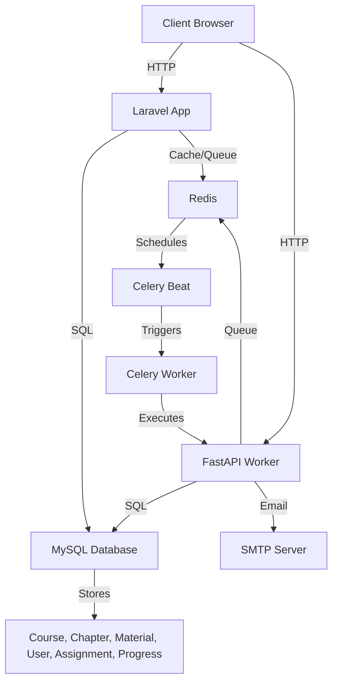

# EduTMS - Education Training Management System

## 專案簡介
EduTMS 是一個為企業與學校設計的教育訓練管理系統，提供課程管理、訓練指派、進度追蹤、角色權限控制（RBAC）與報表生成功能。系統採用 Laravel（網頁與 API 後端）與 FastAPI（非同步任務處理），透過 Docker 多容器架構實現高效部署，支援繁體中文與英文介面，適合台灣數位學習場景。核心代碼位於 [GitHub 倉庫](https://github.com/BpsEason/edu-tms-prototype.git)，其他依賴需手動配置。

## 功能介紹
- **使用者管理與權限（RBAC）**：支援 JWT（Sanctum）與 Session 認證，提供 Admin、Instructor、Student、HR 四種角色，動態儀表板顯示角色專屬 KPI。
- **課程管理**：課程 CRUD，支援縮圖（JPEG/PNG，最大 2MB）、教材（PDF、影片、URL）與分類管理。
- **訓練指派與進度追蹤**：個人/群組課程指派，設定到期日，實時追蹤進度。
- **報表生成**：課程完成率與熱門度報表，支援 Chart.js 可視化與 Excel/CSV 匯出。
- **技術架構**：Docker 化部署（Laravel、FastAPI、MySQL、Redis、Celery），GitHub Actions 實現 CI/CD。

## 安裝與執行指引
### 前置條件
- **系統要求**：PHP 8.2、Python 3.11、Node.js 18、Docker、Docker Compose。
- **依賴**：
  - **PHP**：Laravel 10.x、laravel/sanctum、maatwebsite/excel。
  - **Python**：FastAPI、Celery、redis、sqlalchemy。
  - **Node.js**：Bootstrap 5.3、Chart.js 4.4。
  - **外部服務**：SMTP（如 Mailtrap）用於 Email 提醒。
- **安裝依賴**：
  ```bash
  composer install
  pip install -r fastapi/requirements.txt
  npm install --prefix laravel
  npm run prod --prefix laravel
  ```

### 步驟
1. **克隆專案**：
   ```bash
   git clone https://github.com/BpsEason/edu-tms-prototype.git
   cd edu-tms-prototype
   ```

2. **配置環境變數**：
   - 複製 `.env.example` 為 `.env`：
     ```bash
     cp .env.example .env
     ```
   - 編輯 `.env`，設置資料庫與 SMTP：
     ```env
     DB_DATABASE=edutms_db
     DB_USERNAME=edutms_user
     DB_PASSWORD=secret_password
     SMTP_SERVER=smtp.mailtrap.io
     SMTP_PORT=2525
     SMTP_USERNAME=<your_smtp_username>
     SMTP_PASSWORD=<your_smtp_password>
     ```

3. **啟動 Docker 容器**：
   ```bash
   docker compose --profile dev up -d
   docker compose exec laravel php artisan migrate --seed
   ```

4. **訪問應用**：
   - 網頁端：`http://localhost:8000`
   - FastAPI 健康檢查：`http://localhost:8001`

## 模組架構圖


## 常見問題與解答（FAQ）

### 1. 為什麼選擇 Laravel 和 FastAPI 搭配使用？
**答**：Laravel 提供穩健的 MVC 框架，適合網頁與 API 後端；FastAPI 搭配 Celery 處理非同步任務（如 Email 提醒），利用 Python 生態的靈活性。
**關鍵代碼**（`fastapi/main.py`）：
```python
@celery_app.task
def send_email_task(to_email: str, subject: str, body: str):
    with smtplib.SMTP_SSL(os.getenv('SMTP_SERVER'), os.getenv('SMTP_PORT')) as smtp:
        smtp.login(os.getenv('SMTP_USERNAME'), os.getenv('SMTP_PASSWORD'))
        smtp.send_message(msg)
```
**註解**：FastAPI 與 Celery 實現高效非同步 Email 發送，減輕 Laravel 負載。

### 2. 如何實現角色權限控制（RBAC）？
**答**：使用 Laravel 的 Gate 和 Policy 動態檢查角色權限，確保 Admin、Instructor 等角色有不同訪問權限。
**關鍵代碼**（`app/Policies/CoursePolicy.php`）：
```php
public function create(User $user) {
    return $user->hasRole('instructor') || $user->hasRole('hr'); // 僅 Instructor 和 HR 可創建課程
}
```
**註解**：Policy 提供細粒度權限控制，易於擴展新角色。

### 3. 如何處理課程與教材檔案上傳？
**答**：使用 Laravel 的 Storage 處理縮圖（JPEG/PNG）與教材（PDF、MP4），限制檔案大小並生成公開 URL。
**關鍵代碼**（`app/Http/Controllers/CourseController.php`）：
```php
public function store(CourseRequest $request) {
    Gate::authorize('create-course');
    $data = $request->validated();
    if ($request->hasFile('thumbnail')) {
        $path = $request->file('thumbnail')->store('public/thumbnails');
        $data['thumbnail_url'] = Storage::url($path); // 生成公開 URL
    }
    Course::create($data);
    return redirect()->route('courses.index')->with('success', __('messages.course_created_successfully'));
}
```
**註解**：Storage 確保檔案安全上傳，支援多格式。

### 4. 如何設計資料庫 schema 儲存進度與報表？
**答**：使用 `progress` 表記錄學員進度，`assignments` 表記錄課程指派，支援高效查詢與報表生成。
**關鍵代碼**（`database/migrations/2023_10_12_100006_create_progress_table.php`）：
```php
Schema::create('progress', function (Blueprint $table) {
    $table->id();
    $table->foreignId('user_id')->constrained()->onDelete('cascade');
    $table->foreignId('course_id')->constrained()->onDelete('cascade');
    $table->foreignId('chapter_id')->nullable()->constrained()->onDelete('cascade');
    $table->float('progress_percentage')->default(0);
});
```
**註解**：外鍵約束確保資料一致性，`chapter_id` 可為 null 表示課程整體進度。

### 5. 如何優化報表生成的效能？
**答**：使用 Redis 快取報表結果，預載關聯資料（避免 N+1 問題），並支援非同步匯出。
**關鍵代碼**（`app/Http/Controllers/CourseController.php`）：
```php
public function report(Request $request) {
    Gate::authorize('view-reports');
    $completionReport = Cache::remember('completion_report', 3600, fn() => Course::withCount(['progress' => fn($q) => $q->where('progress_percentage', 100)])->get());
    if ($request->has('export_csv')) {
        return Excel::download(new CourseReportExport($completionReport), 'course_report.xlsx');
    }
    return view('courses.report', compact('completionReport'));
}
```
**註解**：快取與預載減少查詢開銷，Excel 匯出提升用戶體驗。

### 6. 為什麼選擇 Laravel Sanctum 進行認證？
**答**：Sanctum 輕量、易於配置，支援 API Token 與 SPA 認證，適合中小型專案，相較於 Passport（適合 OAuth2）更簡單。
**關鍵代碼**（`routes/api.php`）：
```php
Route::middleware('auth:sanctum')->get('/user', fn(Request $request) => $request->user());
```
**註解**：Sanctum 提供安全的 Token 認證，與 Laravel 生態無縫整合。

### 7. 如何預防常見 Web 攻擊（如 SQL Injection、XSS、CSRF）？
**答**：
- **SQL Injection**：使用 Eloquent ORM 的參數化查詢。
- **XSS**：Blade 模板的 `{{ }}` 自動轉義用戶輸入。
- **CSRF**：使用 Laravel 的 CSRF Token。
**關鍵代碼**（`resources/views/courses/index.blade.php`）：
```blade
<form method="POST" action="/courses">
    @csrf
    <input type="text" name="title">
    <button type="submit">提交</button>
</form>
```
**註解**：`@csrf` 自動生成 Token，確保表單提交安全。

### 8. 如何確保密碼安全儲存？
**答**：使用 `password_hash`（bcrypt）儲存密碼，`password_verify` 驗證，防止明文洩露。
**關鍵代碼**（`app/Http/Controllers/AuthController.php`）：
```php
public function register(Request $request) {
    $data = $request->validate(['email' => 'required|email', 'password' => 'required']);
    $user = User::create([
        'email' => $data['email'],
        'password' => password_hash($data['password'], PASSWORD_BCRYPT),
    ]);
    return redirect()->route('login');
}
```
**註解**：bcrypt 提供安全的不可逆哈希，保護用戶密碼。

### 9. Docker Compose 中各服務的作用？
**答**：
- **laravel**：運行 PHP-FPM，處理網頁與 API 請求。
- **fastapi_worker**：執行 Celery Worker，處理非同步任務。
- **mysql**：儲存課程與進度數據。
- **redis**：快取與任務隊列。
**關鍵代碼**（`docker-compose.yml`）：
```yaml
services:
  laravel:
    build: ./laravel
    ports: ["8000:80"]
    environment:
      - DB_HOST=mysql
      - REDIS_HOST=redis
  fastapi_worker:
    build: ./fastapi
    command: celery -A main worker --loglevel=info
  mysql:
    image: mysql:8.0
    volumes:
      - mysql-data:/var/lib/mysql
  redis:
    image: redis:7.0
volumes:
  mysql-data:
```
**註解**：`mysql-data` 卷宗確保資料持久性，容器重啟不丟失數據。

### 10. 如何處理不同環境（開發/生產）的配置？
**答**：使用 `.env` 檔案區分環境，開發設置 `APP_ENV=local` 啟用除錯，生產設置 `APP_ENV=production` 關閉除錯並強化安全。
**關鍵代碼**（`.env.example`）：
```env
APP_ENV=local
DB_DATABASE=edutms_db
```
**註解**：環境變數模組化，簡化多環境管理。

### 11. 如何確保程式碼品質？
**答**：使用 PHPStan 靜態分析、PHPUnit 測試、Laravel Pint 統一風格，並透過 GitHub Actions 自動化測試。
**關鍵代碼**（`tests/Feature/CourseTest.php`）：
```php
public function test_admin_can_create_a_course() {
    $admin = User::factory()->create(['role' => 'admin']);
    $category = Category::factory()->create();
    $response = $this->actingAs($admin)->post('/courses', [
        'title' => 'Test Course',
        'category_id' => $category->id,
    ]);
    $response->assertRedirect('/courses');
    $this->assertDatabaseHas('courses', ['title' => 'Test Course']);
}
```
**註解**：整合測試驗證課程創建功能，確保程式碼可靠性。

### 12. 如何處理 Git Merge Conflict？
**答**：拉取最新分支（`git pull origin main`），手動編輯衝突檔案，保留正確代碼，然後提交（`git add . && git commit`）。
**關鍵代碼**（`.github/workflows/ci.yml`）：
```yaml
name: CI/CD Pipeline
on:
  push:
    branches: [ main, develop ]
jobs:
  laravel-test:
    runs-on: ubuntu-latest
    steps:
      - uses: actions/checkout@v3
      - run: composer install
      - run: php artisan test
```
**註解**：CI 流程確保分支合併前通過測試，減少衝突風險。

## 技術亮點
- **Laravel 框架**：穩健的 MVC 結構，結合 Sanctum 支援安全認證與多語言。
- **FastAPI 與 Celery**：高效非同步任務處理，與 Redis 整合實現任務排程。
- **Docker 部署**：多容器架構（Laravel、FastAPI、MySQL、Redis），支援快速部署。
- **報表生成**：Chart.js 可視化與 Maatwebsite/Excel 匯出，支援大量數據處理。
- **資料庫設計**：結構化 MySQL 表（Course、Chapter、Progress），高效查詢與報表生成。

## 問題回報
若有問題，請在 [GitHub Issues](https://github.com/BpsEason/edu-tms-prototype/issues) 提交，或聯繫 <your-email@example.com>。
